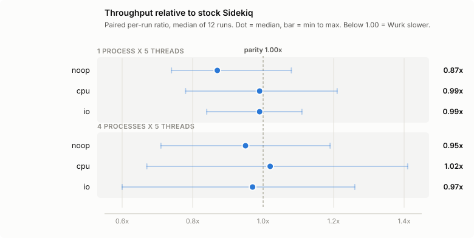
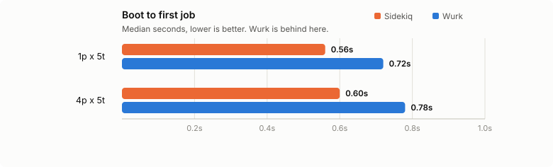

<p align="center">
  
</p>

<h1 align="center">Wurk ⚡</h1>

<p align="center"><strong>Wurk, wurk.</strong> 🪓 <em>Ready to work. Zug zug.</em></p>

<p align="center"><strong>A 100% drop-in replacement for Sidekiq + Sidekiq Pro + Sidekiq Enterprise. Free forever.</strong></p>

<div align="center">

[](https://wurk.demo.developerz.ai/wurk)
[](https://rubygems.org/gems/wurk)
[](https://github.com/developerz-ai/wurk/actions/workflows/test.yml)
[](https://github.com/developerz-ai/wurk/actions/workflows/test.yml)
[](https://www.ruby-lang.org)
[](LICENSE)

</div>

Wurk is wire-compatible with Sidekiq — same Redis keys, same job JSON, same Ruby DSL. Swap one line in your `Gemfile` and your existing jobs, batches, limiters, cron entries, and live Redis data keep working untouched. The Pro and Enterprise feature sets ship in the same free gem, with no license check and no tiers.

**In production:** Wurk runs the background work at [developerz.ai](https://developerz.ai) and at partner deployments — millions of jobs an hour, across many servers, on the fork-based swarm described below. It is not a preview.

**At scale:** Wurk is built for fleets, not just for one box. Kubernetes `/live` + `/ready` probes are a config line, not a sidecar; a bearer-scoped [HTTP API](docs/api-http.md) lets non-Ruby services enqueue and inspect; [OpenTelemetry](docs/telemetry.md) traces propagate client → server; per-queue [global concurrency caps](docs/rate-limiting.md) hold cluster-wide limits; and monitoring is the dashboard you already mount — live SSE, charts, per-job progress, no separate stack to run. See [Wurk extras](#wurk-extras).

**On Sidekiq:** Wurk implements Sidekiq's API because it is a genuinely good API. Sidekiq is human-maintained and funds that work through its paid tiers; Wurk is AI-maintained, which is what lets the same surface be free software. Wurk is independent and not affiliated with or endorsed by Sidekiq or its maintainers — see [Why Wurk exists](#why-wurk-exists).

**On speed:** Wurk is not currently faster than stock Sidekiq — it runs at roughly 0.87×–1.02× depending on workload shape, with parity on CPU and I/O but still behind on framework overhead (noop) and boot time. Numbers, method, and the reproduction command are in [docs/benchmarks.md](docs/benchmarks.md); run them yourself with `rake bench:vs_sidekiq`.

## Install

```ruby
# Gemfile
gem "wurk"
```

```diff
# ...or drop in over an existing Sidekiq stack — delete these, add one line:
- gem "sidekiq"
- gem "sidekiq-pro", source: "https://gems.contribsys.com/"
- gem "sidekiq-ent", source: "https://enterprise.contribsys.com/"
+ gem "wurk"
```

`bundle install && restart`. That's it — `Sidekiq::Worker`, `Sidekiq::Batch`, `Sidekiq::Limiter`, `Sidekiq.configure_server`, and friends all resolve to Wurk.

## Feature matrix

Every capability Sidekiq splits across three tiers is in the one free gem. Columns are Sidekiq's own lineup, so you can see exactly what a migration covers.

| Capability | OSS | Pro | Ent | **Wurk** |
|---|:---:|:---:|:---:|:---:|
| Threaded workers, middleware, retries with backoff, dead set | ✅ | ✅ | ✅ | **✅** |
| Scheduled jobs (`perform_in` / `perform_at`), Active Job adapter | ✅ | ✅ | ✅ | **✅** |
| Web dashboard, Data API, testing modes | ✅ | ✅ | ✅ | **✅** |
| Reliable fetch — atomic `BLMOVE`, survives `SIGKILL` | — | ✅ | ✅ | **✅** |
| Batches: `on(:success/:complete/:death)`, nesting, progress | — | ✅ | ✅ | **✅** |
| Reliable scheduler · reliable client (Redis-outage buffering) | — | ✅ | ✅ | **✅** |
| Queue pause/resume · job expiration (`expires_in`) | — | ✅ | ✅ | **✅** |
| StatsD / DogStatsD metrics export | — | ✅ | ✅ | **✅** |
| Rate limiting — concurrent, bucket, window, leaky, points | — | — | ✅ | **✅** |
| Periodic (cron) jobs, leader-elected so each tick fires once | — | — | ✅ | **✅** |
| Unique jobs, with custom lock context | — | — | ✅ | **✅** |
| Encryption — AES-256-GCM args, zero-downtime key rotation | — | — | ✅ | **✅** |
| Historical metrics retained in Redis | — | — | ✅ | **✅** |
| Multi-process fork parallelism (`swarm`) + rolling restarts | — | — | ✅ | **✅** |
| **Licence** | LGPL-3.0 | commercial | commercial | **MIT** |

### Beyond Sidekiq

Same table, other direction — these have no Sidekiq equivalent at any tier. All opt-in, and free on the job path until you turn them on.

| Capability | OSS | Pro | Ent | **Wurk** |
|---|:---:|:---:|:---:|:---:|
| [Kubernetes `/live` + `/ready` probe listener](#kubernetes-metrics--tracing) | — | — | — | **✅** |
| [OpenTelemetry tracing](docs/telemetry.md) — W3C context, client → server | — | — | — | **✅** |
| [HTTP producer + observe API](docs/api-http.md) — enqueue/inspect over JSON | — | — | — | **✅** |
| [Job status, progress & results](docs/job-status.md) | — | — | — | **✅** |
| [Flows — DAG on batches](docs/flows.md) with piped results | — | — | — | **✅** |
| [Global per-queue concurrency caps](docs/rate-limiting.md) (cluster-wide) | — | — | — | **✅** |
| [Debounce, throttle-to-slot & collapse](docs/unique-jobs.md) | — | — | — | **✅** |
| [Per-job timeouts & deadlines](docs/retries.md) | — | — | — | **✅** |
| Worker topology DSL — fleet roles in code, not `-q` flags | — | — | — | **✅** |
| Dashboard theme, locale & 400-zone timezone picker | — | — | — | **✅** |

Details, and what you give up if you migrate back, in [Wurk extras](#wurk-extras).

## Wurk extras

Sidekiq has no equivalent for any of these — they aren't parity, they're new surface. Each is documented as **Wurk-only**: using it ties that code to Wurk, so migrating back to plain Sidekiq means removing or reimplementing it. Everything that touches the job path is **opt-in and free when unused** — no extra Redis round trip on the hot path until you turn it on. The dashboard's theme, locale and timezone are the exception: they're active whenever the dashboard is, and cost the job path nothing either way.

| Extra | What it does | Give up if you migrate back to Sidekiq |
|---|---|---|
| **[Job status, progress & results](docs/job-status.md)** | Opt-in `sidekiq_options track: true` persists a `status:<jid>` row — state, coalesced progress writes, the return value (size-capped, withheld under encryption) | `Wurk::Status` reads/writes and the dashboard's per-job progress bar |
| **[HTTP producer + observe API](docs/api-http.md)** | A bearer-token-scoped `/v1` JSON API — enqueue, bulk-enqueue, inspect queues/jobs/swarm — mountable standalone, nested in the engine, or via the `wurk api` CLI | The whole `/v1` surface; non-Ruby producers lose their enqueue/inspect path |
| **[OpenTelemetry tracing](docs/telemetry.md)** | W3C `traceparent`/`tracestate` propagated client → server, one span per attempt, linked (not force-parented) across long delays | Distributed traces across your job graph |
| **[Flows — DAG-on-batches](docs/flows.md)** | `Wurk::Flow` chains and fans batches out/in with dependency edges, piped results between nodes, cycle/depth/width limits | The DAG builder, `pipe:` result-passing, `Flow.abandon` |
| **[Debounce, throttle-to-slot & collapse](docs/unique-jobs.md)** | `collapse: { policy: :debounce }` coalesces bursts into one job (last payload wins); `collapse: { policy: :throttle }` admits one job per fixed time slot | Burst coalescing — every enqueue in the window runs standalone again |
| **[Per-job timeouts & deadlines](docs/retries.md)** | `timeout:` bounds one attempt, `deadline:` bounds the whole job from enqueue, enforced by a lightweight per-capsule watchdog thread (no thread-per-job) | Runaway/stuck jobs run unbounded except for `shutdown_timeout` |
| **[Global per-queue concurrency caps](docs/rate-limiting.md)** | `config.global_concurrency = { critical: 20 }` caps in-flight jobs for a queue across the whole cluster, folded into the fetch pipeline | The cluster-wide cap; only per-key `Limiter`s remain |
| **Worker topology DSL** | Declare which queues/classes a given fleet role runs, in code instead of ad hoc `-q` flags | The declarative topology; fall back to CLI queue flags |
| **[Kubernetes probes](#kubernetes-metrics--tracing)** | `config.health_check` opens a thin `/live`/`/ready` HTTP listener, self-electing across a swarm's children | The built-in probe listener; roll your own liveness check |
| **Dashboard theme, locale & timezone** | Light/dark/system theme, per-visitor locale override, and a 400-zone timezone picker for every timestamp in the SPA | Nothing server-side — this is dashboard-only |

AI dashboard panes — anomaly detection, natural-language queries, error triage, and capacity forecasting — are **planned, not shipped**: they're [roadmap M5](docs/idea/13-roadmap.md#m5--ai-dashboard), after the M4.5 extras above.

## Benchmarks

**Wurk is not faster than stock Sidekiq today.** Here is where it actually stands, measured rather than claimed — wurk 1.5.0 vs sidekiq 8.1.6, ruby 3.4.7, local Redis 7.4.10, 5000 jobs/run, 12 runs per topology, paired per-run ratios.

<picture>
  <source media="(prefers-color-scheme: dark)" srcset="docs/assets/bench-throughput-dark.svg">
  
</picture>

Parity on `cpu` and `io`; still behind on `noop`, which is pure framework overhead. The spread is wide because the host carried background load — the paired-ratio median is the number to trust, not any single run.

<picture>
  <source media="(prefers-color-scheme: dark)" srcset="docs/assets/bench-boot-dark.svg">
  
</picture>

Forking is not what closes the throughput gap — a stock Sidekiq user reaches multi-core by running N processes, which is the second topology above. The swarm buys copy-on-write memory and one supervisor, not raw speed.

Method, per-invocation records, workload definitions, and the separate `rake bench` regression gate (wurk vs its own past self, which says nothing about Sidekiq): **[docs/benchmarks.md](docs/benchmarks.md)**. Reproduce with `bin/rake bench:vs_sidekiq`.

## Documentation

- **[Website](https://developerz-ai.github.io/wurk/)** · **[Wiki / full docs](https://github.com/developerz-ai/wurk/wiki)** — the pitch, install, and the complete guide.
- **[API reference (YARD)](https://developerz-ai.github.io/wurk/api/)** — generated docs for the public classes (`Wurk::Worker`, `Wurk::Client`, `Wurk::Configuration`, `Wurk::Batch`, `Wurk::Limiter`, `Wurk::Unique`, and the `Sidekiq::*` aliases). Machine-readable map for AI agents: **[llms.txt](https://developerz-ai.github.io/wurk/llms.txt)**.
- **[Getting started & architecture](https://github.com/developerz-ai/wurk/blob/main/docs/idea/01-overview.md)** — how the swarm, manager, fetcher, and processor fit together.
- **[Starting the worker](https://github.com/developerz-ai/wurk/blob/main/docs/running.md)** — Rails auto-start, the `wurk`/`wurkswarm` runners, and running standalone without Rails.
- **[Configuration reference](https://github.com/developerz-ai/wurk/blob/main/docs/configuration.md)** — every option, env var, YAML key, and CLI flag, with precedence and pool sizing.
- **[Deploying](https://github.com/developerz-ai/wurk/blob/main/docs/deployment.md)** — systemd, Capistrano, Heroku, Docker, Kubernetes, rolling restarts, memory limits.
- **[Secrets & credentials](https://github.com/developerz-ai/wurk/blob/main/docs/secrets.md)** — which values are secret vs config, how to supply them (ENV, Rails credentials, an init file), precedence, and what to never commit.
- **[Active Job adapter](https://github.com/developerz-ai/wurk/blob/main/docs/active-job.md)** — run `ActiveJob`/`deliver_later` on Wurk with `queue_adapter = :wurk`.
- **[Testing jobs](https://github.com/developerz-ai/wurk/blob/main/docs/testing.md)** — fake/inline modes, the jobs array, Minitest and RSpec setup.
- **[Migrating from Sidekiq](#migrating-from-sidekiq)** — the one-line swap and what to expect.

**Features:**

- **[Retries, backoff & the dead set](https://github.com/developerz-ai/wurk/blob/main/docs/retries.md)** · **[Reliability](https://github.com/developerz-ai/wurk/blob/main/docs/reliability.md)** — the failure lifecycle, and the delivery guarantee with its limits.
- **[Batches](https://github.com/developerz-ai/wurk/blob/main/docs/batches.md)** · **[Rate limiting](https://github.com/developerz-ai/wurk/blob/main/docs/rate-limiting.md)** · **[Periodic (cron) jobs](https://github.com/developerz-ai/wurk/blob/main/docs/periodic-jobs.md)** · **[Unique jobs](https://github.com/developerz-ai/wurk/blob/main/docs/unique-jobs.md)** — the Pro/Ent features, free.
- **[Iterable jobs](https://github.com/developerz-ai/wurk/blob/main/docs/iterable-jobs.md)** · **[Middleware](https://github.com/developerz-ai/wurk/blob/main/docs/middleware.md)** · **[Encryption](https://github.com/developerz-ai/wurk/blob/main/docs/encryption.md)** · **[Profiling](https://github.com/developerz-ai/wurk/blob/main/docs/profiling.md)**
- **[Data API](https://github.com/developerz-ai/wurk/blob/main/docs/api.md)** · **[Metrics](https://github.com/developerz-ai/wurk/blob/main/docs/metrics.md)** — inspect queues and jobs from Ruby; job metrics, Statsd/DogStatsD, custom history.
- **[Sentry](https://github.com/developerz-ai/wurk/blob/main/docs/sentry.md)** — built-in error reporting (`sentry-sidekiq` can't be installed alongside Wurk); terminal-failure-only reports, per-job scope, no job args.
- **API reference (parity specs):** [Sidekiq OSS](https://github.com/developerz-ai/wurk/blob/main/docs/target/sidekiq-free.md) · [Pro](https://github.com/developerz-ai/wurk/blob/main/docs/target/sidekiq-pro.md) · [Enterprise](https://github.com/developerz-ai/wurk/blob/main/docs/target/sidekiq-ent.md) — the authoritative surface Wurk matches exactly.
- **[Authentication & authorization](https://github.com/developerz-ai/wurk/blob/main/docs/authentication.md)** — gate the dashboard behind Devise/Warden, Sorcery, Basic auth, or a token; role-based read/write; CSRF.
- **[Securing the dashboard](https://github.com/developerz-ai/wurk/blob/main/docs/dashboard.md)** · **[Metrics history](https://github.com/developerz-ai/wurk/blob/main/docs/metrics-history.md)**
- **[Compatibility & legal basis](https://github.com/developerz-ai/wurk/blob/main/docs/compatibility.md)** — independent reimplementation: Wurk reproduces the API and wire format, not Sidekiq's implementation.
- **Live demo:** [wurk.demo.developerz.ai](https://wurk.demo.developerz.ai)

## Requirements

| Component | Minimum |
|---|---|
| Ruby | `>= 3.2.0` |
| Redis | `>= 7.0.0` |

JRuby, TruffleRuby, and Windows fall back to threads-only mode (no fork) — behaviorally equivalent to stock Sidekiq.

## Running the workers

Under Rails the engine **auto-starts** the swarm on boot — a plain `rails server` already forks workers and fetches. Set `WURK_DISABLED=1` on any process that shouldn't (e.g. the web tier when you run workers on their own dyno).

**One exception — preforking web servers.** A clustered Puma, Unicorn, or Passenger forks its own web workers, so Wurk **refuses** to also fork the swarm there — it would multiply the swarm by the web-worker count, or entangle its supervisor with the server's own fork/signal handling — and logs how to proceed. Either run the swarm as its own process (recommended):

```bash
bundle exec wurkswarm   # forked swarm, real parallelism
```

…or run it inside the web process as threads only, no fork (like Sidekiq embedded):

```ruby
# config/application.rb  (here, not an initializer — server mode is decided before initializers load)
config.wurk.embed_in_web = true
```

Single-mode Puma (the `rails server` default) isn't preforking, so auto-start is unaffected. Full details, flags, and the standalone runners: **[Starting the worker](https://github.com/developerz-ai/wurk/blob/main/docs/running.md)**.

## The dashboard

Mount the engine wherever you like:

```ruby
# config/routes.rb
mount Wurk::Engine => "/wurk"
```

On Devise, wrap it in `authenticate` so only signed-in admins reach it — unauthenticated visitors get bounced to your login page:

```ruby
# config/routes.rb
authenticate :user, ->(u) { u.admin? } do
  mount Wurk::Engine => "/wurk"
end
```

The precompiled SPA ships inside the gem, so consumers never run Node. Outside Rails routing — or when you'd rather keep auth next to the rest of your Wurk config — gate it with any Rack middleware; see **[Authentication & authorization](https://github.com/developerz-ai/wurk/blob/main/docs/authentication.md)** for Devise/Warden/Sorcery/token recipes, role-based read/write splits, and the CSRF model:

```ruby
Wurk::Web.use(Rack::Auth::Basic, "Wurk") { |user, pass| user == ENV["WURK_USER"] && pass == ENV["WURK_PASS"] }
```

Ship a viewer-only board (e.g. a public demo) with no auth code at all by setting `WURK_WEB_READ_ONLY=1` — every mutating request returns 403 and the SPA hides destructive actions.

### Security notes

- **`Wurk::Web.use` and the `authorization` hook gate the dashboard's routes and JSON API** — every controller under the engine mount goes through them.
- **`/wurk-assets/*` (the precompiled SPA's JS/CSS/font bundle) is served unauthenticated, by design.** It's inserted into the host app's own middleware stack ahead of the engine's routes, so it never reaches `Wurk::Web.use`/`authorization`. This is safe because the bundle carries no data — no job payloads, no Redis reads, nothing per-user — it's a static shell, same trust model as any Rails app's `public/assets`. Everything data-bearing (stats, queues, jobs) is served by the JSON API, which *is* gated. If you need to hide even the existence of the bundle (e.g. compliance requires the mount path itself stay secret), put a reverse-proxy rule in front of `/wurk-assets` rather than relying on the engine.
- Redis being unreachable surfaces to the SPA as a structured `503 {"error": "redis_unavailable"}` (JSON endpoints) or an SSE `error` event (the live stream), never a raw 500 — the client can branch on it instead of parsing an HTML error page.

## Encryption

A drop-in for `Sidekiq::Enterprise::Crypto`. It encrypts the **last** positional argument of a job with AES-256-GCM — the client middleware seals it on push, the server middleware opens it before `perform`. Earlier args stay plaintext so you can still triage on `user_id`.

```ruby
# config/initializers/wurk.rb — point at any key source (file, ENV, KMS)
Sidekiq::Enterprise::Crypto.enable(active_version: 1) do |version|
  File.binread("config/crypto/secret.#{Rails.env}.#{version}.key") # exactly 32 bytes
end
```

```ruby
class ChargeCardJob
  include Sidekiq::Job
  sidekiq_options encrypt: true

  def perform(user_id, secret_bag) # secret_bag arrives already decrypted
    Payments.charge(user_id, secret_bag["pan"], secret_bag["cvv"])
  end
end
```

Keys rotate without downtime — keep every still-in-flight version resolvable so old jobs decrypt, then bump `active_version`. A job that can't be decrypted (key rotated away, corrupt ciphertext) goes **straight to the dead set in under a second** rather than crash-looping through 25 retries, with the still-encrypted payload preserved for replay. The dashboard renders encrypted args as `"<encrypted>"`; cleartext is never written to Redis.

## Kubernetes, metrics & tracing

Wurk is built to run as a fleet: one supervisor per pod forking N children across the cores you gave it, drained gracefully on `SIGTERM`, replaced one slot at a time on `SIGUSR1`, and answerable to your existing monitoring rather than a bespoke one.

**Probes.** Opt in to a thin HTTP listener for liveness/readiness:

```ruby
Wurk.configure_server do |config|
  config.health_check(port: 7433)
end
```

| Path | Meaning |
|---|---|
| `/live` | 200 while the Launcher is running; 503 once `stop`/`quiet` is called. |
| `/ready` | 200 only when Redis is reachable **and** the heartbeat fired within `ready_window` (default 30s); 503 otherwise. |

Knobs: `health_check(port:, bind: "0.0.0.0", ready_window: 30)`. In swarm mode one child owns the port; the others poll every 5s and take it over if the owner dies, so probes survive a child restart — a pod never fails a probe just because a worker recycled.

**Getting the numbers out.** Point these at whatever you already run:

| Signal | How it leaves the process | Docs |
|---|---|---|
| Job metrics (counts, latency, per-class timing) | StatsD / DogStatsD via `config.dogstatsd` — into Datadog directly, or into Grafana through your StatsD exporter | [metrics](docs/metrics.md) |
| Historical time series | Retained in Redis, queried by the dashboard or `Wurk::History` | [metrics-history](docs/metrics-history.md) |
| Distributed traces | OpenTelemetry — W3C `traceparent` propagated client → server, one span per attempt | [telemetry](docs/telemetry.md) |
| Queue/job/swarm state for external scrapers and autoscalers | Bearer-token `/v1` JSON API, mountable standalone or via `wurk api` | [api-http](docs/api-http.md) |
| Errors | Built-in Sentry reporting, terminal failures only, no job args | [sentry](docs/sentry.md) |

There is no native Prometheus `/metrics` endpoint — the StatsD export or the `/v1` API is the current path into a Prometheus/Grafana stack.

**Backpressure at fleet scale.** `config.global_concurrency = { critical: 20 }` caps in-flight jobs for a queue across every pod, folded into the fetch pipeline rather than bolted on as a middleware sleep — see [rate limiting](docs/rate-limiting.md).

## Why Wurk exists

Infrastructure this basic should be free software. A Rails app shouldn't need a licence key to get reliable fetch, batches, rate limiting, or cron — those are table stakes, not a premium tier, and the free-software tradition is that the best tools belong to everyone who runs them.

What has made that hard is maintenance: someone has to be paid to do it. Sidekiq funds a decade of *human* maintenance through its paid tiers, which is an honest trade. Wurk makes a different one — it is maintained **AI-first**: implementation, parity suite, docs, and benchmarks are written and kept current by AI agents under human review. A fix, a doc update, or a version bump is no longer somebody's week, which is what makes it practical to:

- ship the entire Pro + Enterprise surface with no tier, no flag gate, and no license check;
- keep parity honest mechanically rather than by hand — an independently written parity oracle suite, pinned to a documented Sidekiq revision, plus third-party gems (sidekiq-cron, sidekiq-unique-jobs, sidekiq-scheduler, sidekiq-status, sidekiq-failures, sidekiq-throttled) running their own upstream suites against Wurk on every push;
- keep adding surface Sidekiq doesn't have — the [Wurk extras](#wurk-extras) above landed as one release;
- hold ourselves to published numbers instead of adjectives — the suite runs against stock Sidekiq every release and ships the results [as measured](docs/benchmarks.md), including the unflattering ones.

DHH makes the broader version of this argument in [Let the agents democratize open source](https://world.hey.com/dhh/let-the-agents-democratize-open-source-9fd630a9): open source fought for everyone's right to change the software they run, and refusing agent-written code re-erects the gate it spent decades tearing down — "all programmers are equal, but some programmers are more equal than others." His subject is contributions; ours is maintenance, which is the same economics from the other end. The reason a licence key guards batches and cron is not that the code is precious, it's that somebody had to be paid to keep it working. Drop that cost and the tier stops being necessary.

What makes it work in practice is that the agents run inside machinery built to check them. The oracles, upstream suites, and published numbers above are gates, not decoration, and the release gate has never once let an unverified gem reach RubyGems. Agents supply the pace, the gates supply the certainty — and when a gate does catch something, the fix is to make that class of mistake structurally impossible rather than to slow the agents down. The release lane derives its own tag from `Wurk::VERSION` so the two can't drift apart; [RELEASE.md](https://github.com/developerz-ai/wurk/blob/main/RELEASE.md) walks through it.

Wurk is MIT and stays that way. If what you need is a commercial support contract and a human on the other end of an email, buying that is a perfectly good answer.

## Migrating from Sidekiq

```diff
- gem "sidekiq"
- gem "sidekiq-pro", source: "https://gems.contribsys.com/"
- gem "sidekiq-ent", source: "https://enterprise.contribsys.com/"
+ gem "wurk"
```

`bundle install && restart`. Wurk reads and writes the same Redis schema, so a rolling deploy can run Sidekiq and Wurk against the same Redis during the cutover. Third-party gems (sidekiq-cron, sidekiq-unique-jobs, sidekiq-scheduler, sidekiq-status, sidekiq-failures, sidekiq-throttled, …) are exercised by running their own upstream suites against Wurk in the [`ecosystem` CI job](https://github.com/developerz-ai/wurk/blob/main/.github/workflows/ecosystem.yml) (see [`test/ecosystem/`](https://github.com/developerz-ai/wurk/tree/main/test/ecosystem)).

Full walkthrough — config side-by-side, the Redis key/`sidekiq_options` mapping, known incompatibilities, and a one-page cutover checklist: **[docs/migrate-from-sidekiq.md](https://github.com/developerz-ai/wurk/blob/main/docs/migrate-from-sidekiq.md)**.

## Contributing

Issues and pull requests are welcome — see **[CONTRIBUTING.md](https://github.com/developerz-ai/wurk/blob/main/CONTRIBUTING.md)** for the dev setup, test layers, and conventions, and **[SECURITY.md](https://github.com/developerz-ai/wurk/blob/main/SECURITY.md)** to report a vulnerability.

## License

MIT. See [LICENSE](https://github.com/developerz-ai/wurk/blob/main/LICENSE).

Wurk is an independent reimplementation of the Sidekiq **API** — it reproduces
the interface and wire format (so your jobs run unchanged), not Sidekiq's
implementation. Reusing an API for interoperability is what the Supreme Court
held to be fair use in *Google v. Oracle* (2021). Sidekiq itself is LGPL-3.0;
Wurk neither vendors nor links against it. "Sidekiq" is a trademark of
Contributed Systems, LLC; Wurk is independent and not affiliated with or
endorsed by them. Full reasoning:
**[docs/compatibility.md](https://github.com/developerz-ai/wurk/blob/main/docs/compatibility.md)**.

<!-- infra#1263 flip verification 1787051748, will not merge -->
